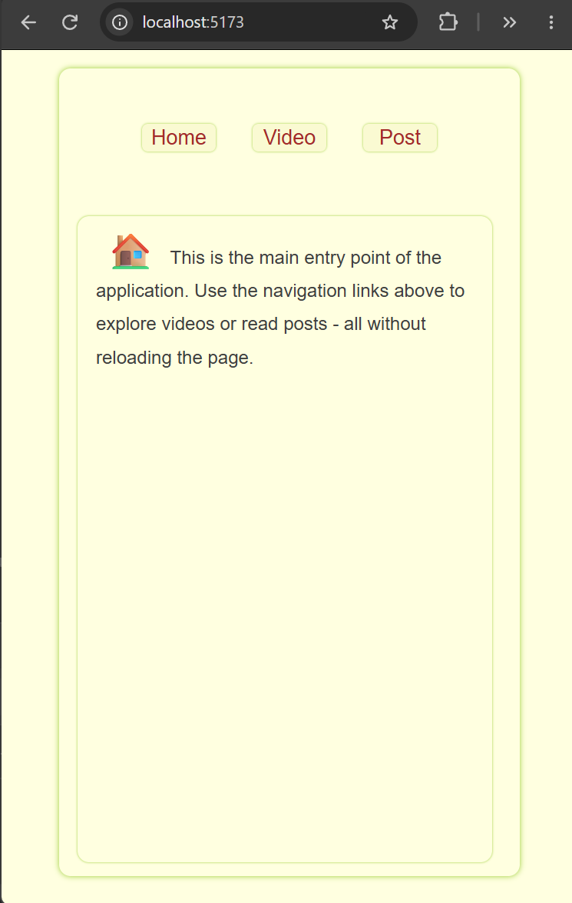
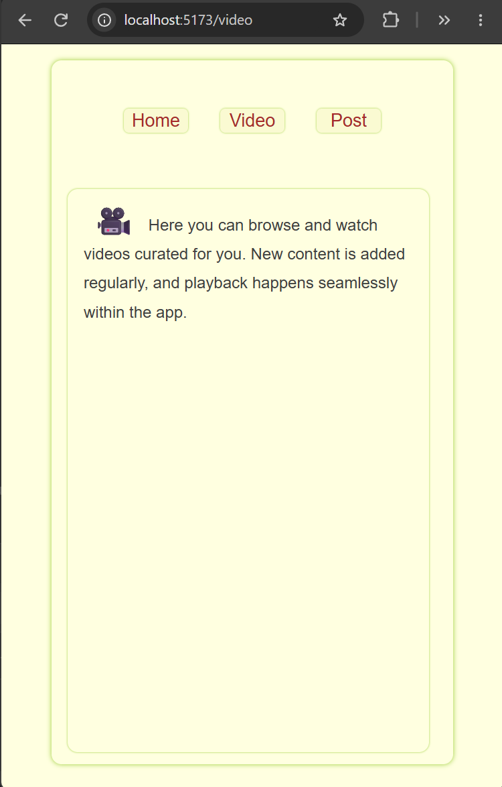
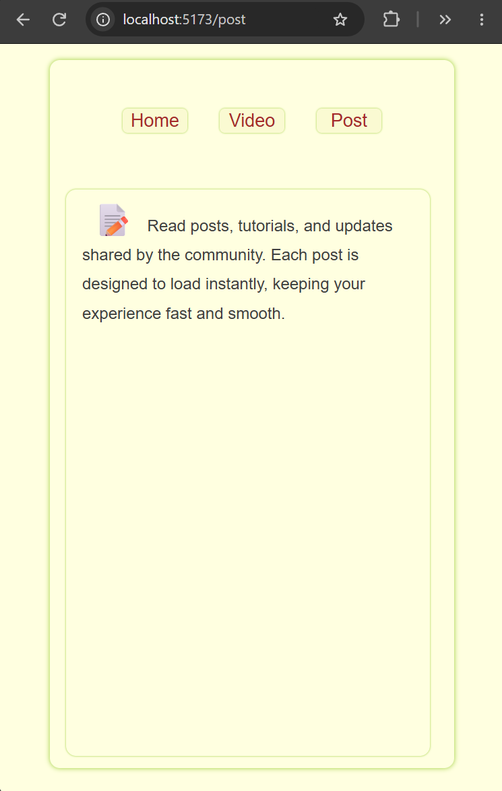

# Single Page Application (SPA) Router
A minimal Single Page Application (SPA) built with JavaScript.

Supports client-side routing using the History API without page reloads.<br><br>

---

## Features

- Navigate between pages without refreshing
- Three pages: Home, Video, Post
- Each page is a separate JS module in the pages folder

---

## Screenshots

<table>
  <tr>
    <th>Home</th>
    <th>Video</th>
    <th>Post</th>
  </tr>
  <tr>
    <td></td>
    <td></td>
    <td></td>
  </tr>
</table>

---

## Project Structure
```
index.html
style.css
app.js
/pages
    home.js
    video.js
    post.js
```
- app.js imports page modules and calls their render functions based on location.pathname
- URL updates using history.pushState()
- Back/forward navigation handled with popstate
